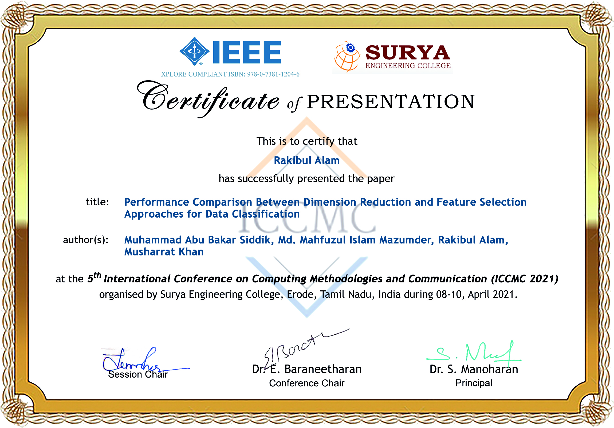

Alhamdulillah. This is my first research paper titled "Performance Comparison Between Dimension Reduction and Feature Selection Approaches for Data Classification" that was published at the 5th International Conference on Computing Methodologies and Communication (ICCMC2021), which was organised by Surya Engineering College, Erode, Tamil Nadu, India. 
